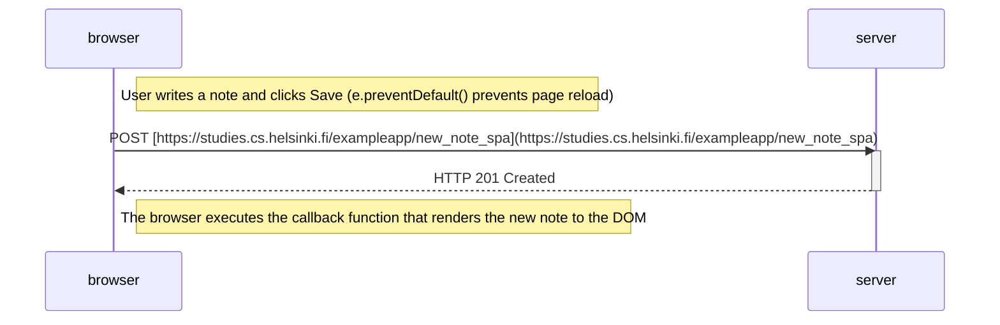

```mermaid
sequenceDiagram
    participant browser
    participant server

    Note right of browser: User writes a note and clicks Save (e.preventDefault() prevents page reload)

    browser->>server: POST [https://studies.cs.helsinki.fi/exampleapp/new_note_spa](https://studies.cs.helsinki.fi/exampleapp/new_note_spa)
    activate server
    server-->>browser: HTTP 201 Created
    deactivate server

    Note right of browser: The browser executes the callback function that renders the new note to the DOM
```
